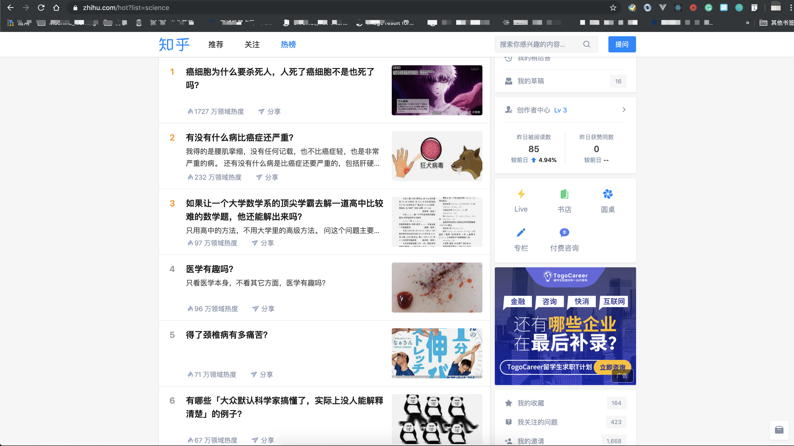

# Lesson 1

##### 需要工具：

- Chrome
- Python 3.7
- iTerm or terminal

##### Library

- requests

## **什么是爬虫**

在做一个程序之前一定要搞清楚这个东西的概念，首先什么是爬虫，我们来看百度百科给出的定义：

> 网络爬虫，是一种按照一定的规则，自动地抓取万维网信息的程序或者脚本。

#### 那么在爬虫中，我们有需要获取哪些信息呢？



_这是一个知乎的热榜页面，假设我们想要获取热榜的内容，那么我们都需要哪些信息呢？_

#### 首先是地址栏中的链接（URL），也就是我们想要去做爬虫，Progamme 无法去浏览页面，他需要一个地址，那么这个 URL 就是我们去告诉 Progamme 需要去获取信息的页面地址，也就是目标页面的地址。

#### 其次就是我们需要获取的页面信息的标识，比如这个页面中，榜单

1. 癌细胞为什么要杀死人，人死了细胞是不是也死光了？
2. 有没有什么病比癌症还严重？
3. 如果让一个大学书学习的顶尖学霸去解一道高中比较难的数学题，他还能解的出来吗？
4. 医学有趣吗？
5. 得了颈椎病有多痛苦？
6. 有哪些‘大众默认科学家搞懂了，实际上没人能解释清楚’的例子

#### 其实这 6 个问题是我自己手动打进去的，是的当我们收到一个命令说，你去搞一份 xxx 网站 xxxx 榜单给我，第一时间我们的想法应该和我刚才的操作一样，一个个一个手写进去，那么假设这个榜单有 100 个，OK 多搞一会，一两个小时总会搞定，那么这个榜单有 1000 个，10000 个，甚至更多呢，这就是我们为什么需要网络爬虫的存在。

#### 基于上面的环境，我们先来搞一个最简单的版本，来获取下这些标题

#### 首先，我们打开 Chrome 的开发者工具，右键检查或者点击更多工具选择开发者工具，mac 的快捷键 option + command + i, windows F12,我们选择开发者工具左上角的鼠标键，点击后去选择这些标题，会看到下面的 HTML 代码

```
<h2 class="HotItem-title">癌细胞为什么要杀死人，人死了癌细胞不是也死了吗？</h2>
<h2 class="HotItem-title">有没有什么病比癌症还严重？</h2>
<h2 class="HotItem-title">如果让一个大学数学系的顶尖学霸去解一道高中比较难的数学题，他还能解出来吗？</h2>
...
```

#### 通过观察我们发现，这些 HTML 的 DOM 标签上，都有着相同的`class`那么我们在开发者工具的 console 中敲下这么一句话

```
# 这里需要一点简单的javascript基础，大家可以去W3C或者MDN上去浏览相关文档

document.getElementsByClassName('HotItem-title')
```

#### 那么我们会得到以下信息

```
HTMLCollection(15) [h2.HotItem-title, h2.HotItem-title, h2.HotItem-title, h2.HotItem-title, h2.HotItem-title, h2.HotItem-title, h2.HotItem-title, h2.HotItem-title, h2.HotItem-title, h2.HotItem-title, h2.HotItem-title, h2.HotItem-title, h2.HotItem-title, h2.HotItem-title, h2.HotItem-title]
```

#### 在 HTML 中，我们知道，`id`是唯一的，但是，`class`是可以重复的，所以我们需要确认我们获取到的就是我们想要的标题信息，而没有其他的，这里我做过确认是可以，在爬取其他目标时，我们要注意，使用`class`作为标识的时候，我们必须确定标识没有被标注在其他 DOM 中

#### 那么我们在 console 中，就刚才那行代码，再添加一点东西

```
# document.getElementsByClassName('HotItem-title')中我们获取的是一个数组，[0]的意思这是去获取数组的第一个元素

document.getElementsByClassName('HotItem-title')[0].innerHTML
"癌细胞为什么要杀死人，人死了癌细胞不是也死了吗？"
```

#### 回车之后我们就获取到了第一个标题的文字信息，这其实就是一种最最最最最简单的`爬虫`，或许这个很多人说这不叫爬虫啊，你不是要获取所有信息吗？好的，我们再修改一下代码

```
titleArr = document.getElementsByClassName('HotItem-title')
titleLen = titleArr.length
for(var i = 0; i < titleLen; i++) {
  console.log(titleArr[i].innerHTML)
}
```

#### 把这段话放到浏览器中，我们会收获到整个话题列表的所有标题

```
癌细胞为什么要杀死人，人死了癌细胞不是也死了吗？
init.js:1 有没有什么病比癌症还严重？
init.js:1 如果让一个大学数学系的顶尖学霸去解一道高中比较难的数学题，他还能解出来吗？
init.js:1 医学有趣吗？
init.js:1 得了颈椎病有多痛苦？
init.js:1 有哪些「大众默认科学家搞懂了，实际上没人能解释清楚」的例子？
init.js:1 老师让研究生读论文，论文内容又看不懂，那么到底要从论文中学习什么？
init.js:1 如果艾滋病在古代被发现会发生什么？
init.js:1 透明物体和白色物体，一个透过所有光，一个反射所有光，为什么一个看起来是透明的，一个看起来是白色的？
init.js:1 正畸的意义大吗？
init.js:1 有没有正常人被逼成精神病的例子？
init.js:1 河马到底有多凶悍？
init.js:1 为什么人类只有一次天然换牙的机会？
init.js:1 如果你是一名医生在上班路上看到有人昏倒（急需）人工呼吸，你救不救？
init.js:1 医院哪个临床科室处在技术变革的前夜？
```

#### 这就是我们对于 HTML 中文字信息部分获取的一种方式，当然在实际的爬虫中，我们很少用到这种方式，这种方式也只能解决最简单的问题，许多时候，我们面临的是多个页面更加复杂的问题，那么我们应该怎么解决呢？

_那么首先，我们应该知道， 一个页面的信息，是怎么来的？_

#### 我们看到的网页信息，大多数都是从数据库中获得，而不是我们的前端小哥哥小姐姐一个个输入到页面当中的，在当今前后端分离的大环境下，数据多数是来自 ajax 异步获取的，那么我们如何获取一个网页的异步数据呢？还是回到我们的开发者工具当中

#### 在 Network 栏中我们可以获取到所有数据，但是这一个栏中，我们还可以做更多的事情，在 XHR（XMLHttpRequest）中，我们可以获取该网页所有的异步数据加载, 如果数据是从这里来的，我们应该怎么获取呢？或者说我们怎么获取更方便呢？

#### 在 Network 的 XHR 中，我们选择这么一个接口，那么我们打开我们的 terminal 或者 iTerm，输入下面的代码

```
curl https://www.zhihu.com/api/v4/search/preset_words?w=
```

#### 看看我们会得到什么？

```
{"preset_words":{"words":[{"id":"152813d9cdf96c12c26f4a2e41adc68550df9faf","type":"general","query":"中国战队 FPX 夺冠","real_query":"s9决赛","weight":1,"begin_ts":1573399462,"end_ts":1573485865,"valid":1},{"id":"ad6ab6295a6693c1e231ada15a9877fb3477e2ce","type":"general","query":"@雷军 知乎首次发问","real_query":"雷军","weight":1,"begin_ts":1573388759,"end_ts":1573475160,"valid":1},{"id":"8ba6cfb3a097d9f795c493e0547c2c6fca64a1ca","type":"general","query":"搭上双十一最后一班车","real_query":"双十一购物清单","weight":1,"begin_ts":1573348284,"end_ts":1573438284,"valid":1},{"id":"2d1c383a04b01bbf8c20d874382d24f44dd24727","type":"general","query":"电影《小丑》上线","real_query":"小丑","weight":1,"begin_ts":1573380804,"end_ts":1573467205,"valid":1},{"id":"c7359b99a51d61ca5dc5d74795f79f08bae53a71","type":"general","query":"双十一决战时刻倒计时","real_query":"双十一购物清单","weight":1,"begin_ts":1573351949,"end_ts":1573434749,"valid":1},{"id":"2ce42fcb5bef32aeda210f19e8b121dccf22a4a3","type":"general","query":"飞儿乐队为什么换主唱","real_query":"飞儿乐队为什么换主唱","weight":1,"begin_ts":1573349192,"end_ts":1573435592,"valid":1},{"id":"7a5178045197129dc51865c2d9753713e2dc9a07","type":"general","query":"李诞奇葩说辩论首秀","real_query":"李诞奇葩说","weight":1,"begin_ts":1573359885,"end_ts":1573446286,"valid":1}],"next_request_ts":1573428007}}
```

#### 不难发现，这个是属于知乎的热搜，也就是说，我们获取了知乎的热搜，那么这是一个复杂的 object（python 中 dict）结构的数据，那么我们怎么提取我们需要的文本数据呢？这就要用到我们的第一个 python 代码

```
import request

#浏览器的请求分为GET和POST具体可以去W3C或者MDN中查看概念和区别

data = request.get('https://www.zhihu.com/api/v4/search/preset_words?w=')
print(data)
```

#### 看看我们会得到什么？

```
<Response [400]>
```

#### 不出意外，报错了

#### 失败了，知道为啥会失败吗？这里我们就要添加一个爬虫的配置项，可以让我们的程序看上去更像一个真人的访问（其实爬虫的过冲就是一个攻与防的过程，但是我不建议大家去做和我一样的网站，大家可以去找自己感兴趣的网站来爬取，注意要是非利益相关的网站）

#### 那么我们在上面的代码中，再加入点东西，让他变得更像一个人在浏览网页

```
# 请求中header中每一项的定义，大家可以自行查询，这里的user-agent也就是我们平时说的UA，就是终端的意思

import requests
headers = {
    'User-Agent': 'Mozilla/5.0 (Windows NT 6.1; Win64; x64) AppleWebKit/537.36 (KHTML, like Gecko) Chrome/58.0.3029.110 Safari/537.36'}
a = requests.get(
    'https://www.zhihu.com/api/v4/search/preset_words?w=', headers=headers).text
```

#### 这样我们就可以获取到刚才的数据啦！

```
{"preset_words":{"words":[{"id":"152813d9cdf96c12c26f4a2e41adc68550df9faf","type":"general","query":"中国战队 FPX 夺冠","real_query":"s9决赛","weight":1,"begin_ts":1573399462,"end_ts":1573485865,"valid":1},{"id":"ad6ab6295a6693c1e231ada15a9877fb3477e2ce","type":"general","query":"@雷军 知乎首次发问","real_query":"雷军","weight":1,"begin_ts":1573388759,"end_ts":1573475160,"valid":1},{"id":"8ba6cfb3a097d9f795c493e0547c2c6fca64a1ca","type":"general","query":"搭上双十一最后一班车","real_query":"双十一购物清单","weight":1,"begin_ts":1573348284,"end_ts":1573438284,"valid":1},{"id":"2d1c383a04b01bbf8c20d874382d24f44dd24727","type":"general","query":"电影《小丑》上线","real_query":"小丑","weight":1,"begin_ts":1573380804,"end_ts":1573467205,"valid":1},{"id":"c7359b99a51d61ca5dc5d74795f79f08bae53a71","type":"general","query":"双十一决战时刻倒计时","real_query":"双十一购物清单","weight":1,"begin_ts":1573351949,"end_ts":1573434749,"valid":1},{"id":"2ce42fcb5bef32aeda210f19e8b121dccf22a4a3","type":"general","query":"飞儿乐队为什么换主唱","real_query":"飞儿乐队为什么换主唱","weight":1,"begin_ts":1573349192,"end_ts":1573435592,"valid":1},{"id":"7a5178045197129dc51865c2d9753713e2dc9a07","type":"general","query":"李诞奇葩说辩论首秀","real_query":"李诞奇葩说","weight":1,"begin_ts":1573359885,"end_ts":1573446286,"valid":1}],"next_request_ts":1573430147}}
```

#### 来试着处理一下我们刚获得的数据，把其中有用的文本保存下来
