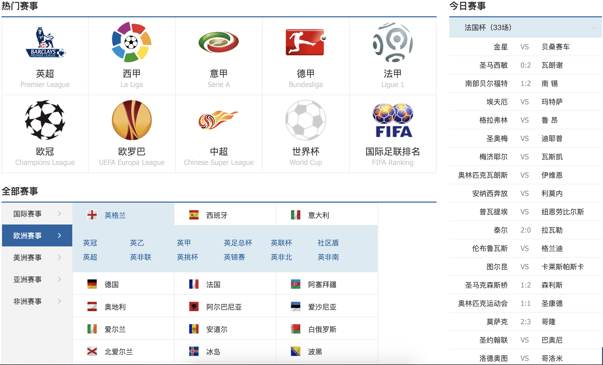
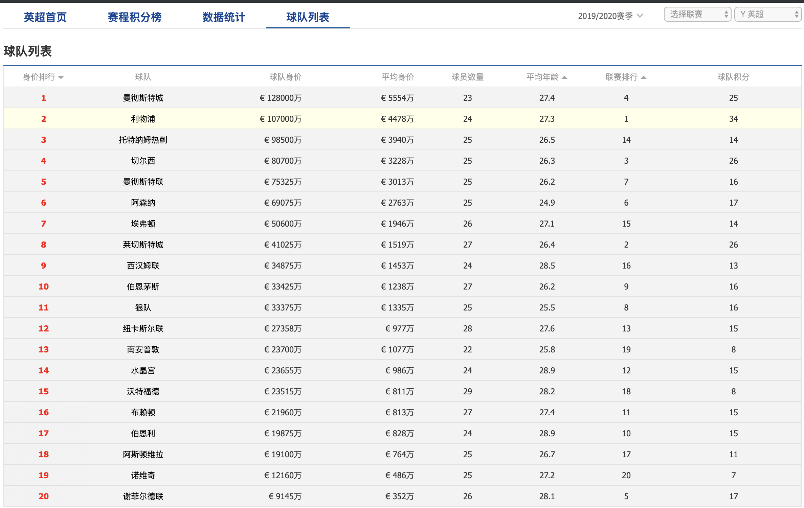
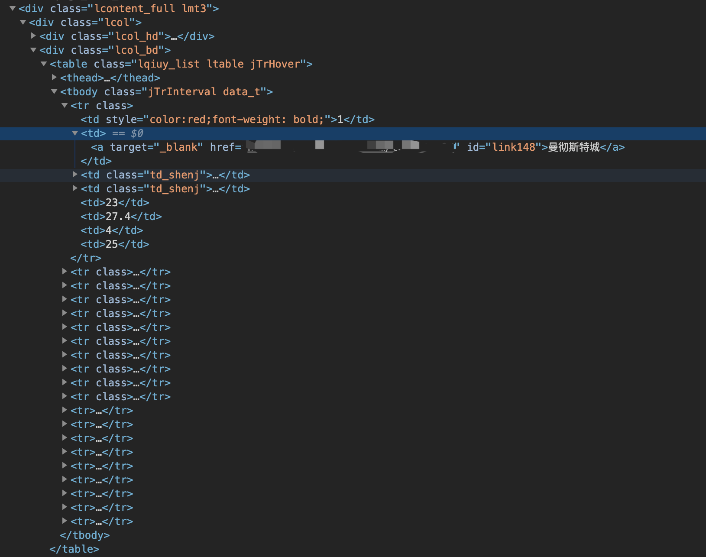

# Lesson 2

### 需要工具

- Chrome
- Python 3.6+
- beautifulsoup4

在上一节我们了解了什么是爬虫，获取网页中数据的两种方式，并且我们亲自实践了，如何去获取 XHR 异步接口中的数据，那么今天，我们就来尝试获取网页 dom 中的数据。

### 做什么？

那么在获取之前，我们首先重头看我们的标题，是如何使用机器学习去预测足球比赛的结果，做任何一项 coding 的工作之前，我们都要养成明确我们开发目标的习惯。

### 需要什么 ？

那么既然是预测足球比赛的结果，首先我们需要足球比赛双方队伍的信息，最简单的，我们需要获取队伍的名称，然后逐层推进，我们需要获取队伍所参加的赛事（如：英超，西甲等等）。那么掌握了基本信息，剩下最重要的数据部分，就是比赛的赔率信息了，这个是是整个预测的核心。

### 哪里找数据 ？

出于对对方网站的考虑，这里我不会公开我爬虫的目标站，但是其实足球赔率的网站有很多，大家可以选取自己喜欢的网站来进行选择，这一节课，我会描述两种获取网页数据的方法，大家可以合理合法的获取这些数据，不用担心，如果找不到，最后我会提供一些赛事的数据供大家做后面的课程

## 获取网页数据



首先我们开始分析这个网站的页面，这里提供了主流联赛的基础数据，那么我们可以以英超为例



从这个图片我们可以看到我们需要的英超联赛球队的基本信息（甚至还多给了一些如身价，平均年龄等等相关信息），那么下一步，我们就应该在 Chrome 打开开发者工具去看一下，数据的来源，来确定我们应该用哪一种方式，进行爬虫。

关于爬虫工具的选择，有 scrapy 或者 beautifulsoup 等等，关于这两者，简单地数据分析项目，我们可以使用 beautifulsoup，而 scrapy 更像是一个端对端的数据下载，清理，分析的工具。这里我们仅仅希望爬虫去帮我们获取数据，我们选择体量更轻一些的 beautifulsoup

通过刷新我们发现，Network 中的 XHR 中没有出现请求接口的（这里注意，如果网站采用了跨域比如 jsonp 的方式，有可能异步接口不会出现在 xhr 中），那么我们就需要用爬虫来获取这些信息，首先我们打开编辑器（VScode 也好，pycharm 也好都可以）

首先我们安装 beautifulsoup

```
pip install beautifulsoup4
```

因为我使用的 Mac OS, 其他操作系统大家可以参考官网的方式来安装 https://www.crummy.com/software/BeautifulSoup/bs4/doc/#installing-beautiful-soup

安装完成之后，我们先来写一个简单的代码，来看一下，beautifulsoup 给我们返回的数据，到底是什么样的

```
from bs4 import BeautifulSoup

# 首先输入目标站地址
from bs4 import BeautifulSoup
import requests

# 首先我们输入目标网址

_url = 'https://xxxxx.com'

# 第一步，我们先用request获取页面的html代码
html_content = requests.get(_url, 'html.parser')
soup_content = BeautifulSoup(html_content.text)

print(soup_content)

```

执行这段代码我们可以发现，这里获取的是整个 html 的的代码文件，包括完整的 dom，就像这样

```
<html>
<head>
...
<head>
<body>
...
</body>
</html>
```

那么我们要做的，就是像第一节中我们讲的那样，把 html 中我们需要的信息，从这个文本信息中，提取出来，那么首先我们要做的就是分析 html

从图片中，我们可以发现，这个页面中的数据，用的是 html 中的 table，而 table 在这个 html 中只使用了一次，我们可以直接使用 table 作为查询的目标，如果有多个 table 怎么办呢？看完 table 后我们可以发现，这个 table 的 body 部分(`<tbody>`)中有唯一的`class=jTrInterval`, 所以，去通过这个`class`去获取球队信息，也是可以的

```
from bs4 import BeautifulSoup
import requests

# 首先我们输入目标网址

_url = 'https://liansai.500.com/zuqiu-5283/teams/'

# 第一步，我们先用request获取页面的html代码
html_content = requests.get(_url, 'html.parser')
soup_content = BeautifulSoup(html_content.text)
team_container = soup_content.find('tbody')

print(team_container)

```

这样我们就可以拿到列表里除去表头的全部信息，通过打印出来的数据我们可以看到，每一条球队的信息，都是是由一个`<tr></tr>`包裹着，那么，我们找到所有的`<tr></tr>`就可以获取到一条一条的球队信息，通过第三张图，我们可以看到曼彻斯特城相关的 tag 上，有一个被隐藏的地址，http://xxxx.com/team/1072/, 由于 1072 只导向曼彻斯特城这个球队，我们可以把这个 1072 当做球队的 id。通过这个规律，我们可以以 id 为 key，球队名称为 value，存到一个字典中，那么球队的数据呢，我们暂时以 json 文件的格式保存在本地。

```
from bs4 import BeautifulSoup
import requests

# 首先我们输入目标网址

_url = 'https://liansai.500.com/zuqiu-5283/teams/'

# 第一步，我们先用request获取页面的html代码
html_content = requests.get(_url, 'html.parser')
soup_content = BeautifulSoup(html_content.text, features="lxml")
team_container = soup_content.find('tbody').find_all('tr')

# 循环整个列表，获取有用信息组合成一个dict
save_data = {}
for i in team_container:
    team_id = i.find('a').attrs['href'].split(
        'http://liansai.500.com/team/')[1][:-1]
    team_name = i.find('a').text
    save_data[team_id] = team_name

print(save_data)

# 结果
{'1072': '曼彻斯特城', '1011': '利物浦', '1238': '托特纳姆热刺', '1173': '切尔西', '1075': '曼彻斯特联', '554': '阿森纳', '565': '埃弗顿', '973': '莱切斯特城', '1286': '西汉姆联', '667': '伯恩茅斯', '978': '狼队', '1137': '纽卡斯尔联', '1128': '南安普敦', '516': '水晶宫', '1274': '沃特福德', '721': '布赖顿', '700': '伯恩利', '555': '阿斯顿维拉', '1144': '诺维奇', '1299': '谢菲尔德联'}

```

我们可以看到，球队的名称和信息已经被我们用 k-v 的格式存在了字典中，接下来，我们就可以保存这个信息到本地（其实这一步主要是为了后面的过程中提升我们的计算速度，我们不需要一次次去网站获取这个结果）。

思考：如何将这个数据存储到本地呢？
提示：需要使用到的 python 库，os，json

## XHR 接口，如何分析参数？

第一节我们已经简单地讲述了如何获取 xhr 接口的数据（使用 requests 库），但是接口中都包含哪些东西呢？我们如何批量的获取不同球队的数据呢，接下来，我们以一个接口为例，来讲述这个问题

例子："http://*****.com/index.php?c=teams&a=ajax_pl&cid=3&fids=806711,868444,810725,878559,806693,868440,806679,806645,868436,806639,869604,806611,868430,806591,806573,806541,806531,806503,805175,851456,848924,844427,832401,799174,731276,731272,731257,731211,731252,793969&hoa=0"

那么分析一个 url，首先我们需要知道，url 中每个符号的含义，

- ? 后面出现的是 **参数**
- & 是不同参数的连接
- = 前面是参数的 key 后面是参数的 value

那么这个 url 中，我们可以获取以下信息

- c: teams
- a: ajax_pl
- cid: 3
- fids: 806711,868444,810725,878559,806693,……
- hoa: 0

fids 中数据太长，我暂时用……代替剩下的数据，那么通过这些数据，我们知道，如果你想获取这个接口的结果，都需要哪些参数，这个接口我们使用 requests 获取后，得到的是以下参数，我提取其中一个举例来分析

```
AWAYHTSCORE: "0"
AWAYMONEYLINE: "0.900"
AWAYSCORE: "1"
AWAYTEAMID: "1072"
AWAYTEAMSXNAME: "曼  城"
BACKCOLOR: "#FF1717"
BIGMONEYLINE: "0.90"
BS: "大"
DRAW: "3.60"
FIXTUREID: "806711"
HANDICAPLINE: "0"
HANDICAPLINENAME: "平手"
HANDINAME: "3"
HOMEHTSCORE: "2"
HOMEMONEYLINE: "0.960"
HOMESCORE: "3"
HOMETEAMID: "1011"
HOMETEAMSXNAME: "利物浦"
LOST: "2.53"
MATCHDATE: "2019-11-11"
MATCHGBNAME: "英格兰超级联赛"
MATCHID: "106"
PAN: "输"
RESULT: "<span class="lblue">负</span>"
SEASONID: "5283"
SIMPLEGBNAME: "英超"
SMALLMONEYLINE: "0.90"
STATUSID: "5"
VSDATE: "2019-11-11 00:30:00"
WIN: "2.69"
lpl_on: "胜"
```

这里我们可以获取到赔率的完整信息，那么

- 这些信息我们都需要完整的存取吗？
- 数据处理第一步，我们应该如何做？
